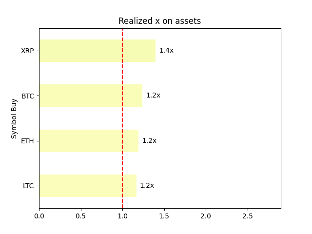

This code reads transaction exports of different crypto brokers and calcualtes the different portfolio statistics like:
- Current value of portfolio
- Total invested money
- Realized profits and losses
- Amount of profits to be taxed based on German tax law (profits with crypto assets are tax free after one year of hodling)
- List of best performing coins in portfolio

and more...

Also, it is possible to add withdrawal exports. If any addresses found, further transactions can be searched by looking at on-chain data. The found swaps and will be added to the list of transactions.

An example output, based on randomly generated transactions by ChatGPT, looks as follows (to recreate run `python src/portfolio.py --demo`):

```console
Total invested money: 7,460$
Total portfolio value: 11,464$
Sum of realized profits: 1,150$
Sum of realized losses: 0$
Sum of realized profits and losses: 1,150$, to be taxed: 1,000$
Total portfolio profit/loss: 4,004$
Total x: 1.5x
```




